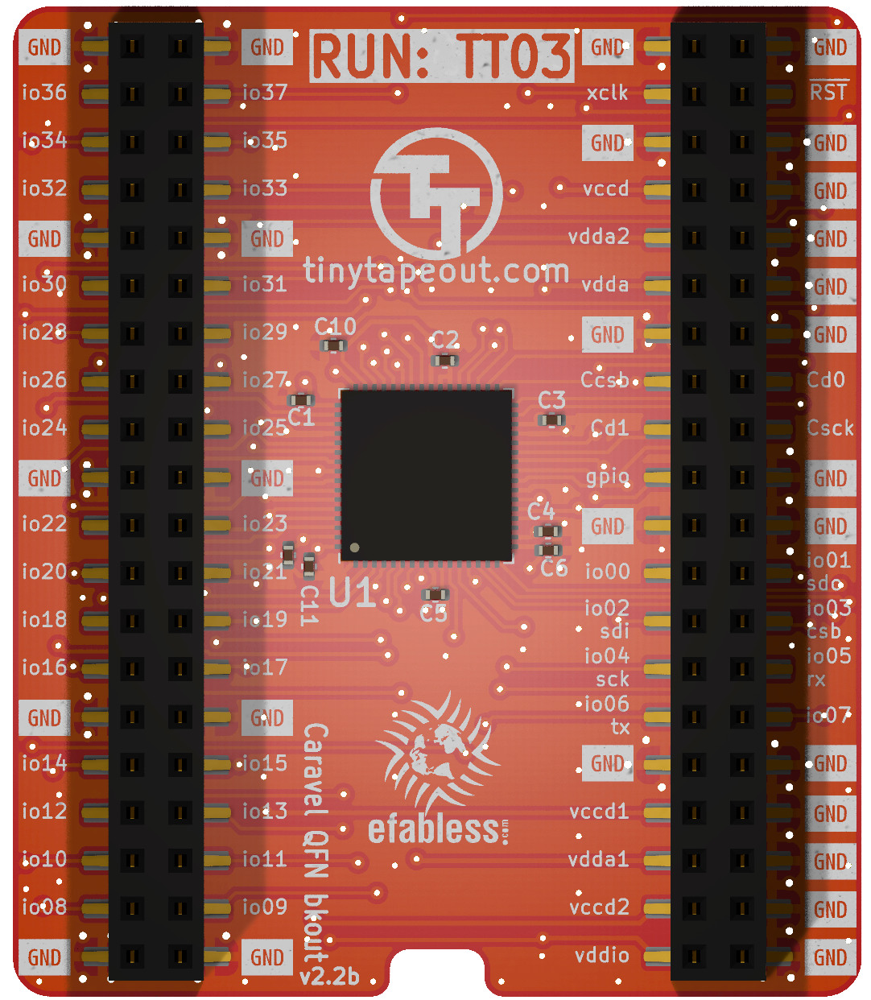
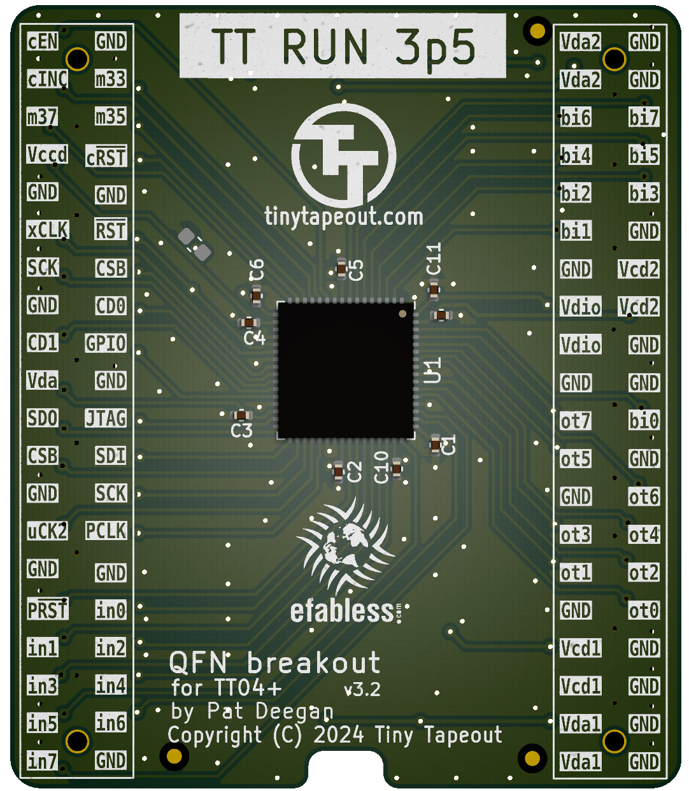

# Tiny Tapeout breakout PCBs

The Tiny Tapeout chips are delivered on a breakout board that allows:
   
   * the demo board to host and interact with the IC and its projects
   
   * easily moving the ASIC to other more specialized PCBs
   
   
The PCBs are keyed such that direction of insertion onto hosts is made clear.

## TT03 QFN breakout

The breakout-tt3-qfn directory holds a QFN breakout suitable for TT02 and TT03 chips.

It provides access to the project inputs, outputs, select pins etc, though the naming on the PCB refers to the caravel mprj_io pin numbers.

The pin headers used up to this point have been dual entry (access from both top and bottom).

## TT04 QFN breakout

The breakout-tt4-qfn directory holds a QFN breakout suitable for TT04 chips.  To date, we've been using it with the TT03p5 trial run (hence the markings), though the pinout remains constant for TT04. 

We've now moved to more easily sourced standard 100 mil pin headers, placed on the bottom of the PCB.  Markings on top are Tiny Tapeout names of the pins (in0 is input 0, ot5 is output 5, etc).

## FPGA ASIC simulation PCBs

Following the same footprints as the breakout boards, the ASIC simulation PCBs are circuits designed to allow for use of demo or custom boards while developing or awaiting the actual chips.  A version was already produced for TT03 and a TT04-compatible version, with the extra I/O and dedicated clock/reset pins, is under development.

