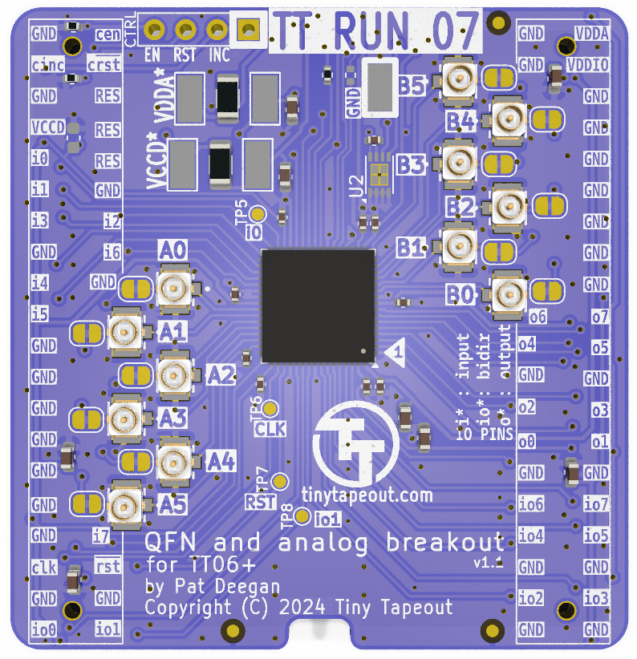
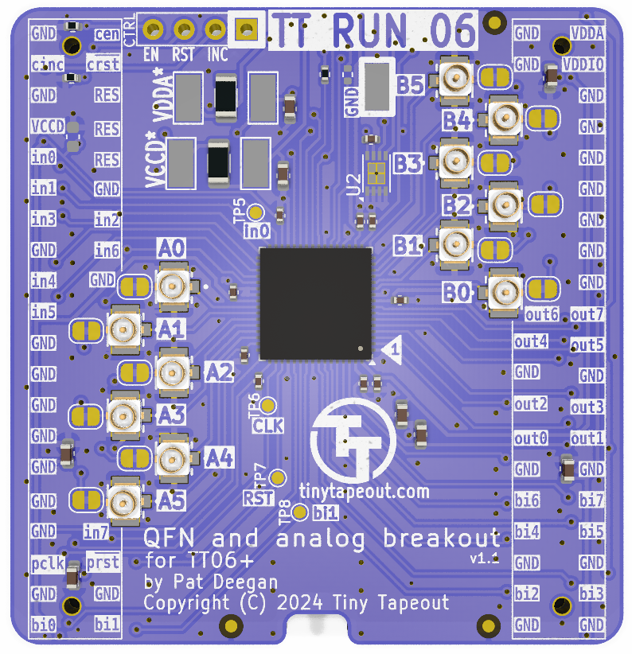

# Tiny Tapeout breakout PCBs

The Tiny Tapeout chips are delivered on a breakout board that allows:
   
   * the demo board to host and interact with the IC and its projects
   
   * easily moving the ASIC to other more specialized PCBs
   
   
The PCBs are keyed such that direction of insertion onto hosts is made clear.

## Repo organization 

Versionning has been refactored such that we only have a single directory, moving forward, which will always be the latest iteration of the breakout board.  Prior versions are tagged and [all available here](https://github.com/TinyTapeout/breakout-pcb/tags).

To facilitate referencing prior boards, renders and schematic PDFs are archived in [docs/historic](docs/historic), and displayed here.

Additionally, there are directories dedicated to socket adapters and "ASIC simulator" FPGA boards.

## TT08 QFN breakout

The [breakout-tt08-qfn](https://github.com/TinyTapeout/breakout-pcb/releases/tag/breakout-tt08) is a QFN breakout suitable for TT06 chips and beyond.  

The ipex/u.fl connectors used for TT06/TT07 were deemed difficult to use for some and led to relatively high capacitance.  This iteration of the breakout replaces these with standard 100mil headers.

Each bank of the analog I/O is available through one such connector and also routed to the headers down to the demoboard, but only in order to allow for

  * custom host boards to access these I/O
  
  * pull-downs to ground to avoid floating pins.

[TT08 breakout schematic PDF](docs/historic/breakout-tt08-qfn.pdf)

## TT07 QFN breakout

The [breakout-tt07-qfn](https://github.com/TinyTapeout/breakout-pcb/releases/tag/breakout-tt07) is a QFN breakout suitable for TT06 chips and beyond.  It was to have only minor changes as compared to the TT06 breakout PCB but, unfortunately, has the ASIC project MUX `reset_n` and `increment` wires crossed and is thus mislabelled.  

Analog I/O is available through ipex/u.fl connectors and also routed to the headers and down to the demoboard, but only in order to allow for

  * custom host boards to access these I/O
  
  * pull-downs to ground to avoid floating pins.

[TT07 breakout schematic PDF](docs/historic/breakout-tt07-qfn.pdf)

## TT06 QFN breakout

The [breakout-tt06-qfn](https://github.com/TinyTapeout/breakout-pcb/releases/tag/breakout-tt06) is a QFN breakout suitable for TT06 chips and beyond.  With TT06 came support for analog and mixed signal projects, as well as a new pinout for the QFN to support this and the on-board project MUX.  These breaking changes are reflected in a new, wider, footprint that sidesteps the possibility of placing incompatible prior breakouts on the demoboard.

Sensitive analog I/O is available through ipex/u.fl connectors.

The analog I/O is also routed to the headers and down to the demoboard, but only in order to allow for

  * custom host boards to access these I/O
  
  * pull-downs to ground to avoid floating pins.
  
Unfortunately, the production run for those demo boards had very low valued resistances which, if you wish to interact with analog projects, had to be removed or replaced (see the errata on the [demoboard documentation](https://github.com/TinyTapeout/tt-demo-pcb/tree/tt06) for details).

[TT06 breakout schematic PDF](docs/historic/breakout-tt06-qfn.pdf)

## TT04/TT05 QFN breakout

The [breakout-tt04-qfn](https://github.com/TinyTapeout/breakout-pcb/releases/tag/breakout-tt04) is a QFN breakout suitable for TT04 and TT05 chips.  This breakout, with some differences in silk screen, was used for the TT03p5 trial run, as well as TT04 and TT05.

This PCB moved to more easily sourced standard 100 mil pin headers, placed on the bottom of the PCB.  Markings on top are Tiny Tapeout names of the pins (in0 is input 0, ot5 is output 5, etc).

[TT04 breakout schematic PDF](docs/historic/breakout-tt04-qfn.pdf)

## TT03 QFN breakout

The [breakout-tt03-qfn](https://github.com/TinyTapeout/breakout-pcb/releases/tag/breakout-tt03) holds a QFN breakout suitable for TT02 and TT03 chips.

It provides access to the project inputs, outputs, select pins etc, though the naming on the PCB refers to the caravel mprj_io pin numbers.

The pin headers used up to this point have been dual entry (access from both top and bottom).

[TT03 breakout schematic PDF](docs/historic/breakout-tt03-qfn.pdf)

## FPGA ASIC simulation PCBs

Following the same footprints as the breakout boards, the ASIC simulation PCBs are circuits designed to allow for use of demo or custom boards while developing or awaiting the actual chips.  A version was already produced for TT03 and a TT04-compatible version, with the extra I/O and dedicated clock/reset pins, is under development.

