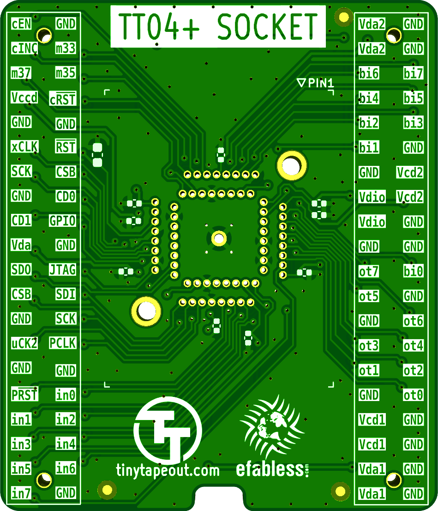
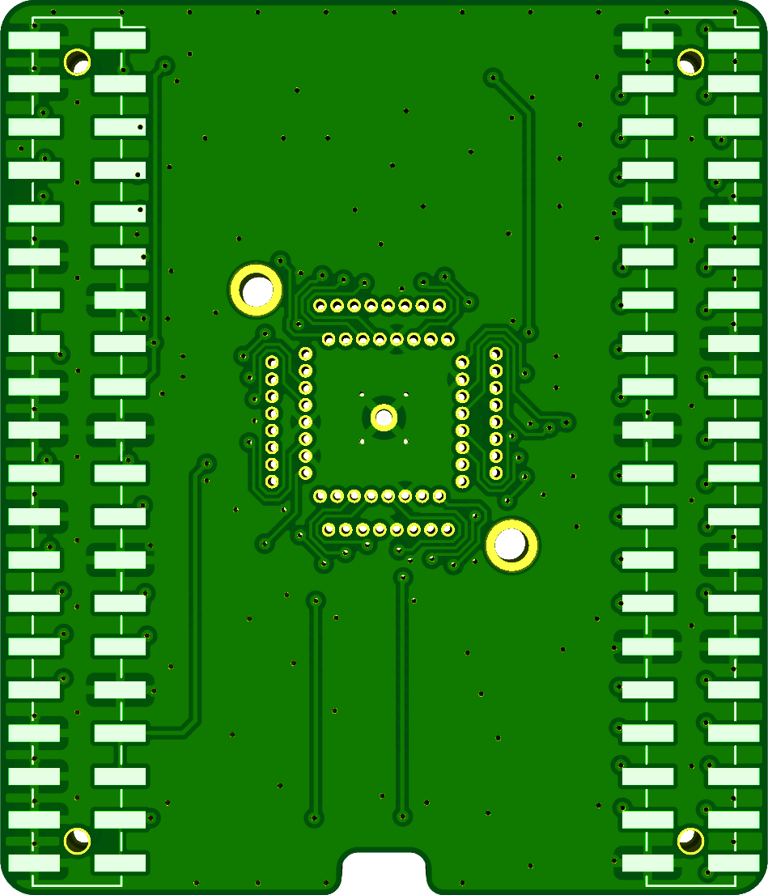

# Tiny Tapeout QFN64 socket adapter (TT04+)

For testing Tiny Tapeout chips not yet soldered to a breakout board. 
Based on the [TT04 QFN breakout board](https://github.com/TinyTapeout/breakout-pcb) by Pat Deegan.

&emsp;

To be used with Chinese 9x9-64-0.5 QFN sockets, such as those available with these vendors:
[#1](https://www.aliexpress.com/item/1005005700155525.html) /
[#2](https://www.taobao.com/list/item/708110757161.htm) /
[#3](https://www.taobao.com/list/item/736773077075.htm)
