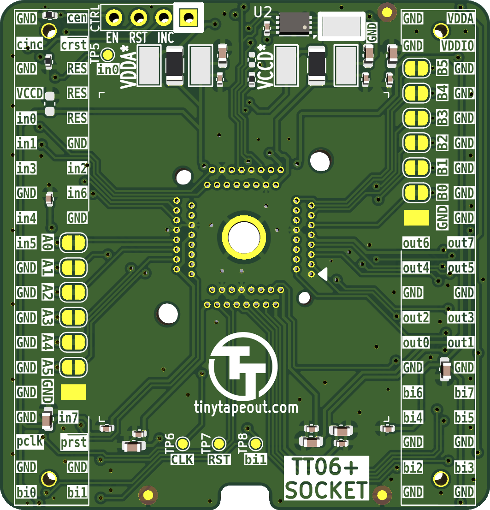
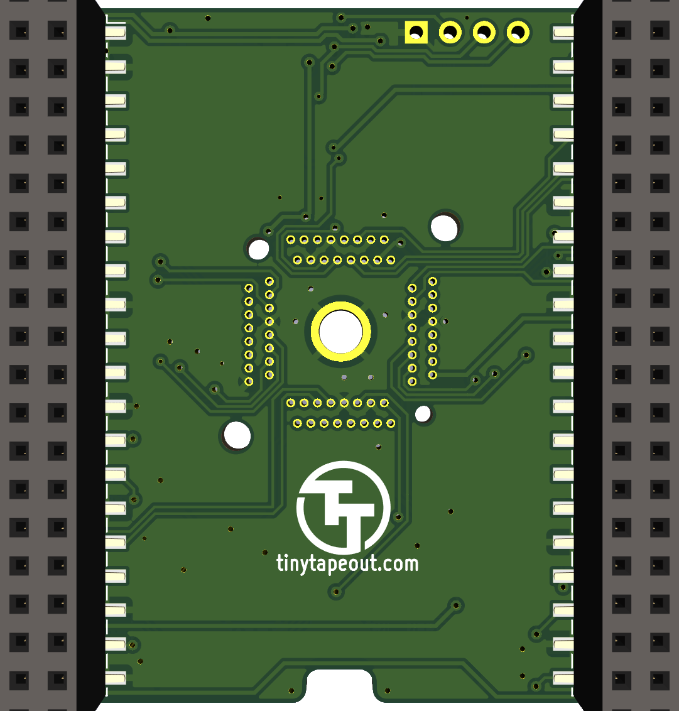

# Tiny Tapeout QFN64 socket adapter (TT06+)

For testing Tiny Tapeout chips not yet soldered to a breakout board. 
Based on the [TT06 QFN breakout board](https://github.com/TinyTapeout/breakout-pcb) by Pat Deegan.

&emsp;

To be used with [Enplas QFN-64BT-0.5-01](https://www.waveshare.com/qfn-64bt-0.5-01.htm) sockets.
